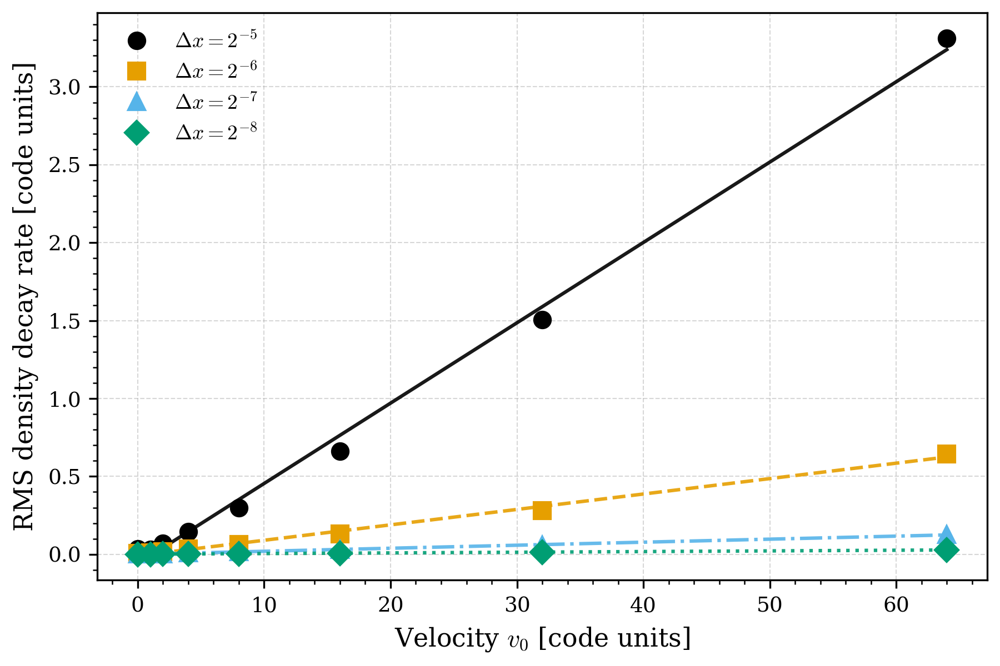
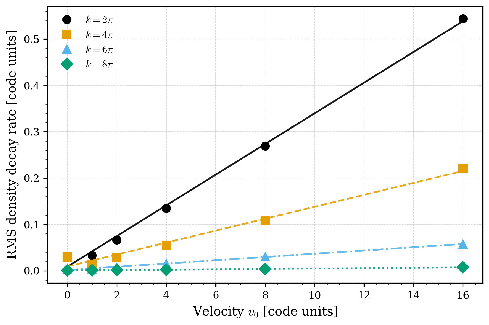
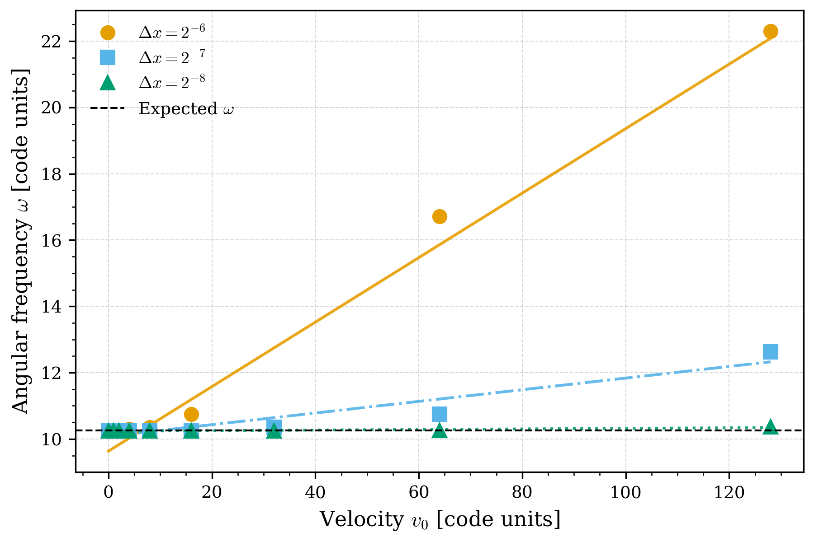

# Quantifying the Effects of Numerical Diffusion in RAMSES

## Overview
This project investigates velocity-dependent numerical diffusion in the astrophysical simulation code RAMSES. The work explores how numerical diffusion and numerical dispersion impact systems evolving under hydrodynamics and self-gravity in grid-based simulation schemes. The results including realistic galaxy simulations using AGORA initial conditions, and idealized perturbation tests.

  

## Project Goals
- Quantify numerical diffusion as a function of local absolute velocity
- Investigate Galilean invariance violations in RAMSES
- Study numerical dispersion effects on wave propagation and stability
- Evaluate large-scale impacts in galaxy simulations

## Methods:
This project includes:
- Modifications to the RAMSES source code (Fortran 90)
- Custom 1D perturbation experiments
- Hydrodynamic and self-gravitating simulations
- HPC workflows using SLURM
- Python analysis and visualization pipelines

## Repository Sturcture
- `scripts/` - python analysis scripts
- `derived_data/` - derived data from RAMSES outputs
- `results/` - processed figures and animations
- `docs/` - thesis poster and report

## Main Results
- Measured velocity-dependent numerical diffusion coefficients
- Developed an empirical diffusion model
- Identified numerical dispersion affecting wave propagation and gravitational stability
- Demonstrated large-scale effects in galaxy simulations

<table align="center">
  <tr>
    <td align="center">
       
      <em>Low absolute velocity region</em>
    </td>
    <td align="center">
       
      <em>High absolute velocity region</em>
    </td>
  </tr>
</table>

<table align="center">
  <tr>
    <td align="center">
       
      <em>Numerical diffusion versus velocity (resolution-dependence)</em>
    </td>
    <td align="center">
       
      <em>Numerical diffusion versus velocity (scale-dependence)</em>
    </td>
  </tr>
</table>

  
   
  <em>Numerical dispersion versus velocity</em>

## Tools/Software Used
- Fortran 90
- Python
- RAMSES
- SLURM
- HPC clusters (Digital Research Alliance of Canada)

# Author
Maahir Patel